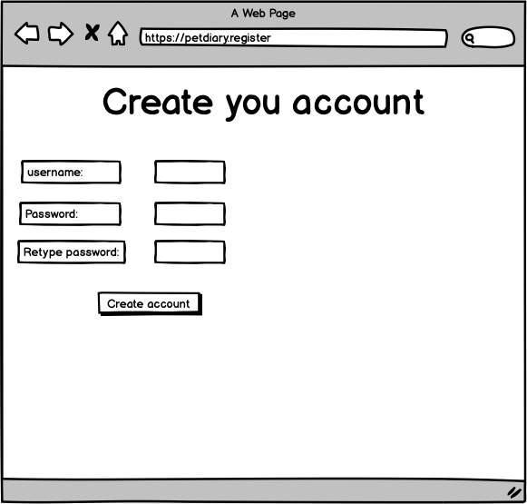
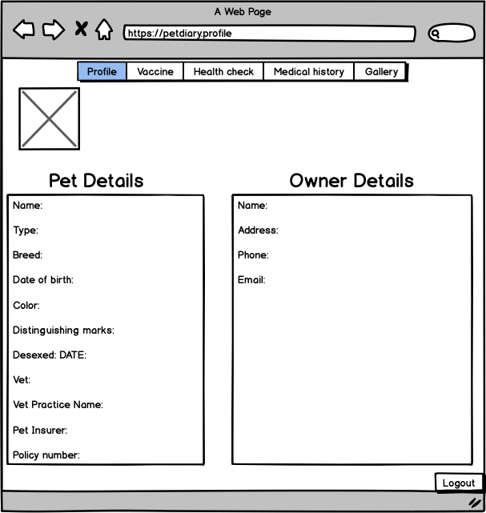
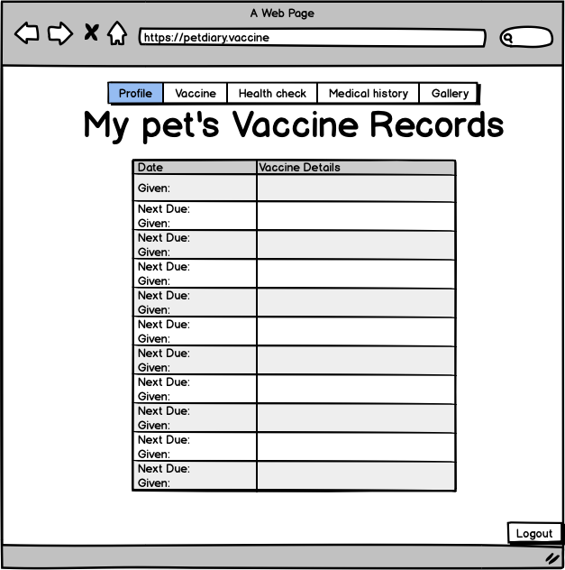
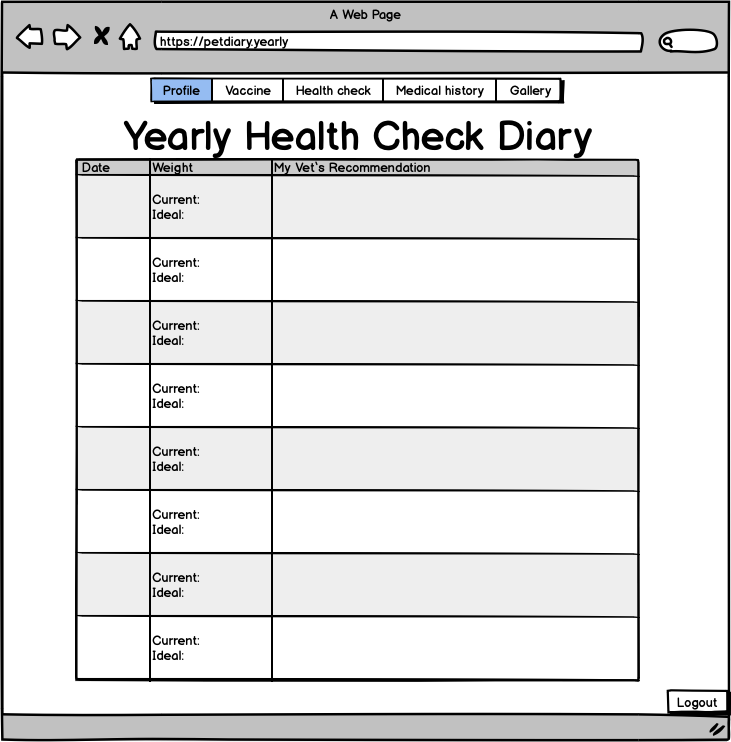
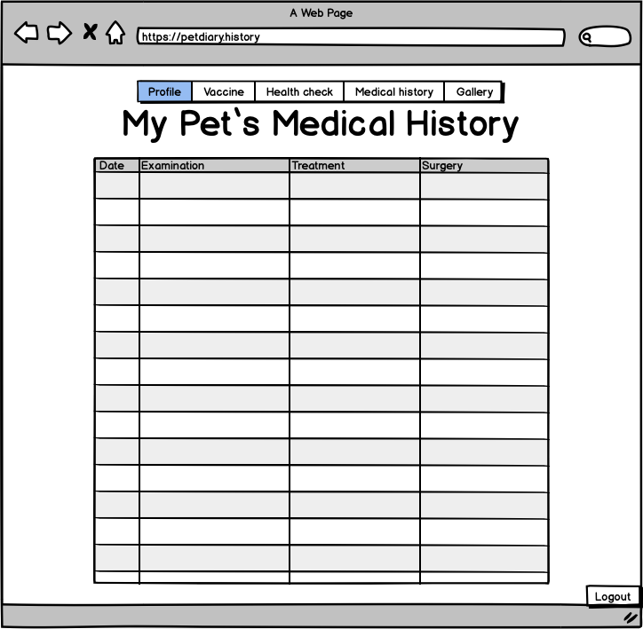
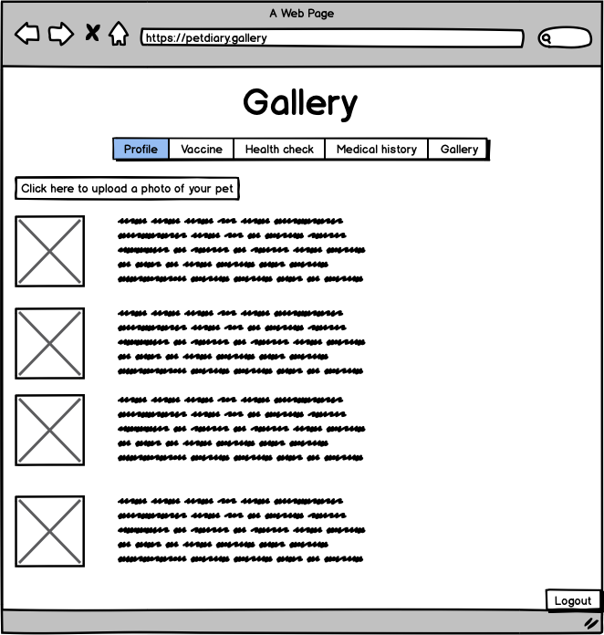

#Pet Diary:

## Idea:

The user will be able to:

* Upload a profile photo of their pet.
* Write a resume about their pets with details like name, breed, age.
* Create an account with a username and password.
* Store their pet's vaaccination safelly.
* Create reminders for future vaccinations, vet visits.
* Upload photos of strange behaviour that the pet might do so it would be possible to keep as a history or to show the vet.

## Link to trello board:

[Trello board that tracks work and ideas](https://trello.com/b/UJZCgc6E/pet-history)

## Wireframes:

